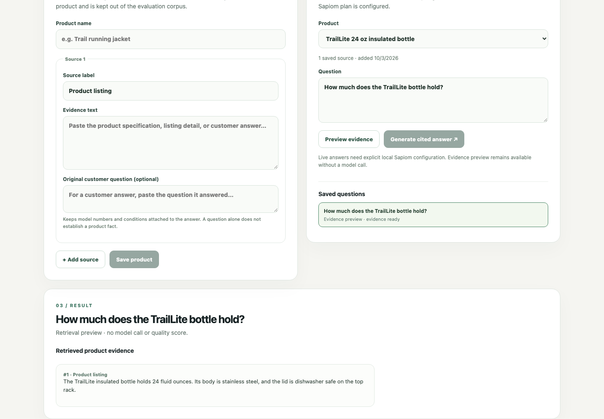
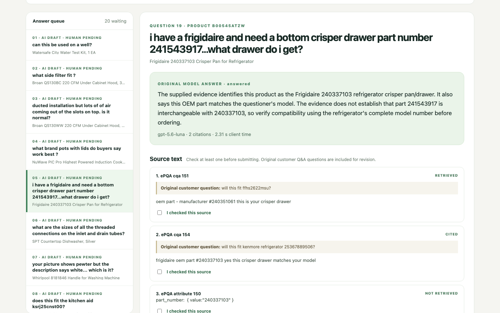
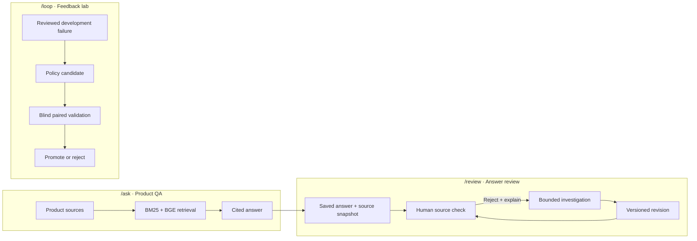

# Ablatrix

**Product answers grounded in evidence, with a review loop for the answers that miss.**

Ablatrix is a local product QA prototype. It retrieves product-specific passages, generates cited answers through Sapiom when explicitly enabled, and gives reviewers a way to investigate and revise weak answers. A separate feedback lab tests answer-policy changes against fresh products before promotion.

## See it

**Product QA —** a synthetic bottle question and its retrieved source. This preview makes no model call.



**Answer review —** a saved paid answer beside its original customer-question context and source text. This example is awaiting human review.



## How it works



Every completed `/ask` answer enters `/review`. One local worker saves jobs, source decisions, and immutable answer versions in SQLite. It can use saved evidence or, with a separate opt-in, search approved hosts once and read at most two pages before requesting one revised answer. Search snippets are leads, not citations. The historical 20-answer evaluation remains at `/paid-review`; workspace decisions never enter its results. The lab keeps development, validation, and final products separate; synthetic demo scores never count as model improvement.

## Reproduce one workflow

Requires Node.js **24.10+**. The first preparation downloads pinned public embedding weights.

```sh
npm ci
npm run feedback:prepare
npm run local
```

Open [Feedback lab](http://127.0.0.1:4173/loop), choose **Synthetic demo**, then select **Canvas Panel 8X10 Pack of 12** and its development question **“how many are included?”**. Get an answer: the deterministic baseline abstains. Open the retrieved passage, mark the abstention as unnecessary, and save a review explaining that the supported package count should be stated directly, with that passage selected. In **Propose an update**, select the reviewed failure and inspect the candidate policy. Run **paired validation** on held-back questions, then inspect the saved decision and policy history. This is a deterministic workflow demonstration: its answers and validation verdicts are synthetic, so they establish no model-quality gain.

For your own products, open [Product QA](http://127.0.0.1:4173/ask), save source text, and preview retrieval. A completed answer links to [Answer review](http://127.0.0.1:4173/review): explain a flaw, continue reviewing another answer, then return to compare and source-check the revision. Live Router answers require explicit local opt-in, a server-side credential, and a shared planning allowance. Optional source discovery has a separate opt-in. The allowance is **not** a provider-enforced spending cap or a settled bill.

To reproduce that answer-to-review workflow without paid calls, run `node --import tsx --test server/workspace-review-api.test.ts`. It exercises the HTTP API and real background worker with an injected synthetic transport, including duplicate rejection requests, stale decisions, and restart recovery. See [workflow and limits](docs/workspace-answer-review.md).

### Compare saved answers

Open [Compare answers](http://127.0.0.1:4173/compare) and load the **synthetic example**. Review anonymous A/B answers against their complete source context, record correctness, support, and adequacy, then inspect the report and export. The example makes no model calls; its reviews and results stay labeled synthetic. Missing judgments remain pending, and uncertain judgments remain unresolved.

The workbench also imports completed experiment packets through `npm run compare -- import --db .data/context-comparisons.sqlite --packet /absolute/path/packet.json`. Packets freeze answers, sources, and the original-question context intervention. A saved packet protects review integrity; it does not prove that an experiment was planned before generation or authenticate provider records. See the [comparison protocol](docs/context-comparison-protocol.md) and [packet format](docs/context-comparison-contract.md).

## Private demo package

The [restricted hosted demo](docs/hosted-demo.md) packages `/ask` → `/review` → correction → export with verified gateway identity, viewer/reviewer/operator roles, one persistent SQLite volume, and offline backup/restore. Synthetic templates let invited users rehearse the workflow without paid calls. Hosting, HTTPS identity configuration, and an external deployment are still pending; this is not a public live service.

## Saved results

| Experiment | Verified observation | What it establishes |
| --- | --- | --- |
| [Pinned product QA batch](docs/evidence/paid-qa-batch-2026-09-28/report.md) | **20/20** one-attempt live Router calls completed on 20 distinct products; **52/52** returned citation quotes occur verbatim in their saved retrieved passages. [Inputs](docs/evidence/paid-qa-batch-2026-09-28/manifest.json) and [outputs](docs/evidence/paid-qa-batch-2026-09-28/results.json) are saved. | Call completion and mechanical quote provenance on curated evidence, **not** answer correctness or citation relevance. |
| [Live search ablation](docs/pilot-live-results-2026-09-24.md) | **16 matched pairs / 32 answers** across eight GitHub Actions questions; omitting an extra web search cut the **median paired answer-stage time by 81.2%** and **meter-derived aggregate cost by about 96.2%**. [Per-call measurements](docs/evidence/search-ablation-2026-09-24.csv) are public. | A narrow source-given search decision. Timing starts before optional search and ends after the Router answer; shared source collection is excluded. Cost uses 16 searches × $0.006 plus published Router token rates: $0.100216 search-on versus $0.003858 search-off. It is not a settled per-call bill. |

**Quality status:** Exact quote membership is distinct from whether a quote supports a claim, whether an answer is correct, and whether users prefer it. The product batch has 20 historical human judgments, but they predate restoration of the original customer-question context and are excluded by the current review protocol; **0/20 context-aware human judgments** are saved. The ablation's independent blind human correctness review is also pending. Neither experiment proves an answer-quality improvement; no policy was promoted on these results.

For implementation details, see [architecture](docs/architecture.md), [feedback-loop setup](docs/feedback-loop-local.md), [investigation limits](docs/revision-investigation.md), [corpus provenance and license](docs/product-corpus.md), the [remaining release plan](docs/next-release-plan.md), and the [build and evidence ledger](docs/build-plan.md). The earlier [search ablation](docs/search-ablation.md) and [research agent](docs/sapiom-accounting.md) are documented separately.
