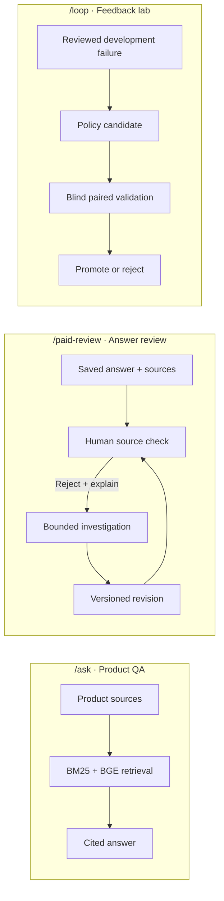

# Ablatrix

**Product answers grounded in evidence, with a review loop for the answers that miss.**

Ablatrix is a local product QA prototype. It retrieves product-specific passages, generates cited answers through Sapiom when explicitly enabled, and gives reviewers a way to investigate and revise weak answers. A separate feedback lab tests answer-policy changes against fresh products before promotion.

## See it

**Product QA —** a synthetic bottle question and its retrieved source. This preview makes no model call.


**Answer review —** a saved paid answer beside its original customer-question context and source text. This example is awaiting human review.


## How it works



The review worker saves jobs and source decisions in SQLite. It can use saved evidence or, with a separate opt-in, search approved hosts once and read at most two pages before requesting one revised answer. Search snippets are leads, not citations. The lab keeps development, validation, and final products separate; synthetic demo scores never count as model improvement.

## What has been measured

- **20/20** product-disjoint paid answer calls completed in the [pinned batch](docs/evidence/paid-qa-batch-2026-09-28/report.md).
- **52/52** citation quotes matched saved source text. Quote matching checks provenance, not whether the answer is correct.
- **No measured answer-quality gain** has been established. Policy candidates that did not show a gain were not promoted.

## Run locally

Requires Node.js **24.10+**. The first preparation downloads pinned public embedding weights.

```sh
npm ci
npm run feedback:prepare
npm run local
```

Open [Product QA](http://127.0.0.1:4173/ask), [Answer review](http://127.0.0.1:4173/paid-review), or the [Feedback lab](http://127.0.0.1:4173/loop). Fixture mode is the default; it needs no Sapiom key and makes no paid calls. Live Router answers and optional source discovery require explicit local opt-in, a server-side credential, and a shared planning allowance. The allowance is **not** a provider-enforced spending cap or a settled bill.

For implementation details, see [architecture](docs/architecture.md), [feedback-loop setup](docs/feedback-loop-local.md), [investigation limits](docs/revision-investigation.md), [corpus provenance and license](docs/product-corpus.md), and the [build and evidence ledger](docs/build-plan.md). The earlier [search ablation](docs/search-ablation.md) and [research agent](docs/sapiom-accounting.md) are documented separately.
