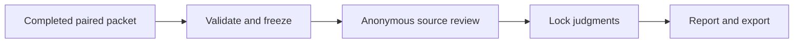

# Next release plan

Updated October 9, 2026. These five stages describe the product roadmap; their numbers are not GitHub pull-request numbers. The older [build and evidence ledger](build-plan.md) retains the project's implementation history.

## Where the build stands

| Stage | Intended result | Current position |
| --- | --- | --- |
| 1. Baseline and rubric | A saved answer, inspectable sources, and explicit quality judgments | Existing product QA, historical review packets, and feedback-lab rubrics provide the foundation. Context-aware human review remains pending. |
| 2. General product answers | New questions can enter the same review workflow | PR #22 connects completed `/ask` answers to `/review` through an immutable, recoverable source snapshot. |
| 3. Asynchronous correction | A reviewer explains a flaw, moves on, and returns to a versioned revision | PR #22 joins general answers to the existing bounded investigation/revision worker. Jobs, receipts, decisions, source provenance, and restart guards are preserved. |
| 4. Frozen quality comparison | Import a completed experiment, review anonymous pairs, and publish an honest report | Implemented on `codex/frozen-context-comparison`: 193 server tests, 28 browser checks, build and independent review pass. A fresh live quality comparison remains a separate execution step. |
| 5. Restricted hosted demo | Another person can inspect and exercise a bounded, durable workflow | Follow the workbench with authentication, access controls, deployment recovery, and a reproducible demonstration. |

PR #22 completes the shared engineering workflow across the first three stages, building on earlier implementations. Its merge does not establish a quality gain or complete the pending human judgments.

## Stage 4: comparison workbench

Build one complete path:

Use the [original-question context protocol](context-comparison-protocol.md). Its intervention changes only whether the model receives original customer-question metadata. Both arms retain the same current rules, policy, model configuration, retrieval, answer bodies, and quote options. Reviewers see the complete source context for both answers.

### Ship in this slice

- Completed-packet import with immutable identities, manifest checks, source provenance, matched-pair checks, and safe duplicate replay.
- Anonymous review cards with explicit correctness, support, and adequacy judgments tied to exact answer versions and source context.
- Clear pending counts and a locked report that separates supported, correct, adequate answers from unresolved judgments and mechanical citation checks.
- A synthetic rehearsal that covers import, review, report, export, and restart without provider calls.
- Tests for changed snapshots, hidden arm identity, incomplete or uncertain judgments, and separation from historical experiments and human quality claims.

Reuse the provider's existing execution and receipt mechanisms when a future experiment is approved. A new paid runner, model fine-tuning, more production dashboards, and a database migration are outside this slice's acceptance criteria.

### Keep the execution gate explicit

The workbench can be released with no fresh live packet and with human review still pending. Before executing a real comparison, freeze the plan and fresh cohort, audit product-family overlap, reserve its bounded calls, and obtain authorization for that concrete experiment. A completed-packet import freeze is not proof that the plan existed before generation. Imported live packets retain retrospective provenance with provider authenticity and pre-generation freeze unverified; internal consistency checks do not certify those claims.

Exclude the 56 historical ASINs across the curated, final, and paid corpora, plus subsequent workspace or experiment exposures. Preserve the two remaining legacy validation products and existing final corpus. The available pinned train pool permits a separate cohort, but no new benchmark is frozen or validated yet.

Use the existing 20 paid answers for development review and rubric calibration. Their **20 historical judgments and 0 current source-context-valid judgments** remain visible with their provenance. Saving new judgments does not turn those previously inspected products into fresh cases. The latest single `/ask` trial is also a development workflow observation, with its human decision separate from its AI source check.

**Stage 4 is done when:** the synthetic workflow passes its tests, production build, code review, and browser smoke check; packet invariants hold across reload/restart; the report preserves pending and inconclusive outcomes; and existing saved experiments and review records remain unchanged. Running more paid calls is unnecessary to meet this build gate.

## Stage 5: restricted hosted demo

Deploy a small demonstration with an explicit operating scope:

1. Authenticate invited users and enforce server-side access to products, runs, reviews, and experiment packets. Replace local reviewer-name attribution with authenticated identity for hosted writes.
2. Keep provider credentials on the server. Default public viewing to saved, redacted evidence and synthetic interaction. Gate any live generation by role, an explicit bounded allowance, concurrency limits, and the existing dispatch rules.
3. Give the single revision worker durable storage, restart recovery, bounded queue behavior, health checks, and inspectable failures. Test backup and restore of the workspace, review, and provider ledgers together.
4. Verify the complete deployed path: answer or fixture generation, review, queued correction, version comparison, restart recovery, and report export. Show the limits of the demonstration beside the result.

Choose database and hosting configuration from that operating scope. PostgreSQL becomes useful when the deployment needs concurrent application writers, shared worker access, or managed durability. A single-instance private demonstration can use SQLite with persistent storage and verified backups. Database choice does not replace queue correctness, access controls, or quality review.

**Stage 5 is done when:** an invited reviewer can complete the demonstrated workflow, unauthorized access and unbounded dispatch are blocked, a restart preserves jobs and receipts without duplicate calls, and the saved result is reachable through one stable public documentation link. Publishing or enabling paid access requires its own authorized release action.

## What the release may claim

Completed engineering can support: “Built a product QA workflow with hybrid retrieval, immutable source snapshots, asynchronous revision, and reproducible paired evaluation.”

Keep separate evidence for:

- Successful provider attempts and exact quote membership.
- Source applicability, answer correctness, and adequacy under the frozen rubric.
- Human review, AI-assisted assessment, and synthetic verification.
- A revision accepted on one answer and a measured effect across fresh paired cases.
- Local planning allowances, token estimates, and verified provider charges.

There is no new human-reviewed quality improvement claim at this stage. Preserve inconclusive and negative results alongside successful workflow tests. Once each slice meets its acceptance criteria, move to the next build stage; additional paid experiments should answer a frozen question rather than serve as a substitute for shipping the remaining product work.
